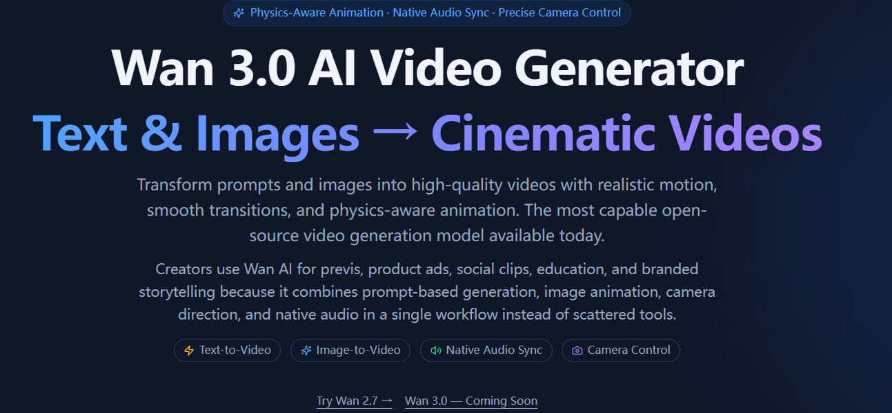

# Wan 3.0




## Overview

[Wan 3.0](https://wan30ai.com/) is a practical AI video workflow for teams that need faster concept testing, cinematic iteration, and cleaner early-stage storytelling.

It works well when you want to move from prompt to usable footage without a heavy production setup, especially for product demos, launch assets, and short-form experiments.

## Why It Stands Out

- Faster iteration for multi-shot video ideas
- Useful for storyboards, teasers, and quick campaign drafts
- Easier to compare different visual directions before a bigger production pass

## Example Workflow

```bash
idea -> storyboard -> prompt -> multi-shot render -> refine -> publish
```

## Prompt Example

```text
Create a cinematic launch teaser with two scene transitions, soft camera motion, realistic lighting, and a polished product-focused ending frame.
```

## Product Link

Explore the official [Wan 3.0 product page](https://wan30ai.com/) to see the current workflow, examples, and capabilities.

